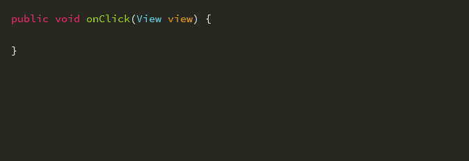

## Plain Java vs. Android Studio
Most concepts in Java also apply to the way we write code in Android Studio, however they might take a slightly different shape. In this section we will review how the concepts of this week are used in Android Studio. This can help you understand the tools needed to build this week's app. 

###  Classes in Android Studio
In Android Studio, you will see classes as well, though the way in which they are used is slightly different. In your app, the different screens are represented by `Activities`. These activities are actually classes as well! 

However, instead of having a `main` method associated with them as in the example above, they make use of the method `onCreate` which is called when the respective activity is (surprise) created. Inside this method, the corresponding layout for the activity is set, after which you can start adding your own code.

        public class MainActivity extends AppCompatActivity {

            @Override
            protected void onCreate(Bundle savedInstanceState) {
                super.onCreate(savedInstanceState);
                setContentView(R.layout.activity_main);

                // Now we can start doing things!
            }
            
        }

Of course, Android Studio allows for you to create custom classes that depict something tangible, like the `Student` one as well. However throughout an app you will see classes that take many other shapes. All runnable code you write for your app will be contained inside a method of some kind, which is in turn containde inside a class.

Imagine a super simple app that contains information about one student and shows this information when the user clicks a button. In this particular app, there are two classes that interact. These classes are often depicted in what is called an UML diagram. They are helpful because they give a quick overview of what classes, variables and methods are present in the program's architecture. 

 

In the image above, we can see the `Student` model class with its fields and method and a hypothetical `MainActivity` containing a field to hold a `Student` object, a click handler for a button of some sort and of course `onCreate()`. These kind of diagrams are often used to illustrate how classes relate to each other and what kind of content they contain.

## Parameters and return values in Android Studio
The concept of parameters and return values applies in Android Studio as well. A structure that is often present in Android code is a click handler that responds to click events on some element of the UI, for example a button:

        // This method will be called when the button inside the activity is clicked
        public void onClick(View view) {
            int id = view.getId();
            Log.d("View id:", Integer.toString(id));
        }

This method gets a parameter, a `View` object called `view`. This object refers to the element in the layout, which are called views in Android, that triggered the method. This `View` object is available in the scope of the `buttonClicked` method, which means that we can use methods associated with the `view` object. 

Classes like `View` in Android studio often have a lot of such methods, which are accessed by the dot operator, just like in Exercise 1. Usually the IDE will provide you with a list of these methods once you add a dot after the object and begin typing, like for example to access the `getId()` method, which returns the associated id number (an integer) of the view in question (see the gif below). Many methods like this return a specific type of value, which in turn can be used to determine your program's logic or perform other operations. The return value of the methods is also shown on the right side of the dropdown menu in the IDE.

However, sometimes it's useful to see all of them to understand what they do and which one you need. For this, [Android's official documentation](https://developer.android.com/reference/) is your best friend! For example, [this page](https://developer.android.com/reference/android/view/View) contains information about the `View` class. Useful!

 In addition to methods that we write ourselves and methods that handle events like a click, some methods are called by the app itself automatically when needed. A good example of this is `onCreate`, this method is run when the app starts, but we do not have to call it. 
 
 Even though the method is called automatically, it still gets something passed as a parameter: `Bundle saveInstanceState`. This `Bundle` object can be accessed all throughout the scope of the `onCreate` method, and contains information about the state of the app if it was restored from an earlier time. There are many such methods that are called automatically, a lot of which are part of the [activity lifecycle](https://developer.android.com/guide/components/activities/activity-lifecycle#java) which handles the different states of different screens inside an app throughout time. This week we will use `onCreate()` (of course) and `onSaveInstanceState()` in our app. 